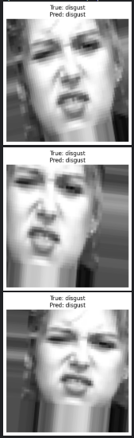
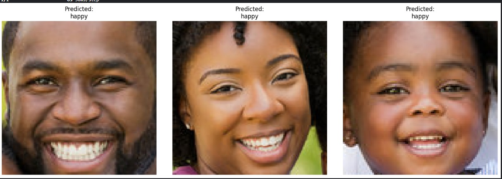

# Facial-Emotion-Detection usingTransfer learning

Detecs Facial Emotion using Convolutional Neural Network

# Emotion Detection with MobileNet and Transfer Learning 🎭📷

This project demonstrates a complete pipeline to perform **emotion classification** on face images using **transfer learning** with MobileNet and **image augmentation** techniques. It includes training, validation, prediction, and visualization—all in an easy-to-follow notebook.

---

## 🚀 Project Highlights

- ✅ **Transfer Learning** using MobileNet (ImageNet pretrained)
- 🧪 **Image Augmentation** to prevent overfitting and improve model robustness
- 🧠 Face-based **emotion prediction** using Haar Cascade detection
- 🖼️ Results shown on cropped faces from new test images

---

## 🧠 What is Transfer Learning?

**Transfer Learning** allows to use a pre-trained model (like MobileNet trained on ImageNet) and adapt it to our own dataset. Instead of training from scratch, we reuse the knowledge already learned by the model to save time and improve accuracy—especially helpful when our dataset is small.

In this project:

- **Base Model**: MobileNet (`include_top=False`) is used to extract features.
- **Custom Head**: We added a few dense layers and a softmax output layer for our 7-class emotion classification.
- **Frozen Layers**: All MobileNet layers are frozen to retain their ImageNet-learned features.

---

## 🔄 What is Image Augmentation?

Image Augmentation artificially increases the diversity of training dataset by applying random transformations like:

- Rotation
- Zooming
- Shearing
- Width/height shifts
- Horizontal flips (optional)

This helps the model generalize better and reduces overfitting.

```python
datagen = ImageDataGenerator(
    rotation_range=40,
    width_shift_range=0.2,
    height_shift_range=0.2,
    rescale=1./255,
    shear_range=0.2,
    zoom_range=0.2,
    validation_split=0.2
)
```

📁 Dataset:
We used the CK+ (Cohn-Kanade) dataset for training. The dataset is assumed to be structured like this:

```python
ck-dataset/
├── angry/
├── happy/
├── sad/
├── surprise/
├── ...   and other total 7 classes
This Dataset Has a Total of 982 images we used a total of 788 images for Training and 193 images for validation.
```

🔍 Real-Time Face Emotion Prediction:

We used Haar Cascade to detect faces from a new image:

```python
face_cascade = cv2.CascadeClassifier('haarcascade_frontalface_default.xml')
faces = face_cascade.detectMultiScale(gray_img, scaleFactor=1.03, minNeighbors=8)
```

### 🖼️ Predicted Faces

| Detected Faces | Predicted Emotion |
| -------------- | ----------------- |

| 
| 
